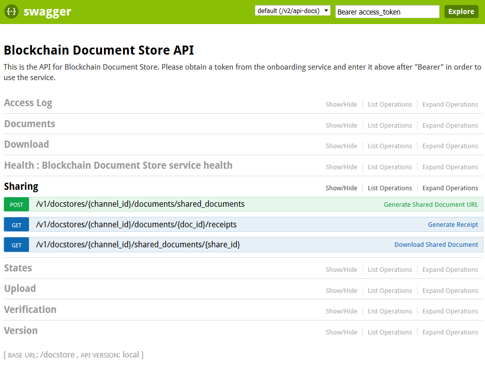

---

copyright:
  years: 2018
lastupdated: "2018-10-29"

---

{:new_window: target="_blank"}
{:shortdesc: .shortdesc}
{:screen: .screen}
{:codeblock: .codeblock}
{:pre: .pre}

# Blockchain Document Store API
The [Blockchain Document Store API ](https://dev.pbsa-dev1.us-south.containers.mybluemix.net/docstore/swagger-ui.html){:new_window},
for managing documents on a blockchain network, is shown below in Figure 1. In the [Swagger API ](https://dev.pbsa-dev1.us-south.containers.mybluemix.net/docstore/swagger-ui.html){:new_window} interface,
enter your **Onboarding Token** (Bearer &lt;token&gt;) in the upper right to authenticate to the service.
Click any **Expand Operations** link to view the details for
each endpoint, including **Model**, **Model Schema**, **Parameters** and **Response Messages**.

Descriptions of the Blockchain Document Store [API endpoints](#api-endpoints) are provided below. To manually
call an endpoint, use the [Swagger interface ](https://dev.pbsa-dev1.us-south.containers.mybluemix.net/docstore/swagger-ui.html){:new_window}.

**Attention**: Calling a Blockchain Document Store API endpoint requires submitting the *channel_id*
for the user's member organization; the *channel_id* authorizes user actions to be recorded on the channel
ledger.

  Figure 1. Blockchain Document Store API  

## API endpoints
Brief descriptions of the Blockchain Document Store API endpoints are provided below. To manage documents, call
the applicable [Blockchain Document Store API ](https://dev.pbsa-dev1.us-south.containers.mybluemix.net/docstore/swagger-ui.html){:new_window}
endpoint (in the Swagger API interface, click **Expand Operations**).

### Access Log
<dl>
<dt> get /v1/docstores/{channel_id}/documents/{doc_id}/access_log</dt>
<dd>Returns the document access log (in JSON) for the specified *doc_id*.</dd>
</dl>

### Upload
<dl>
<dt> POST /v1/docstores/{channel_id}/documents</dt>
<dd>Uploads multiple documents—files to object storage and JSON to blockchain. This method requires a multipart request; one part must map document IDs to types: for example, Content-Disposition: form-data; name="types" {"docId1":"drivers license","docId2":"vehicle list","docId3":"owner json"}. The other part must map each docId to the file name or JSON string: for example, Content-Disposition: form-data; name="docIds" {"docId1":"license.pdf","docId2":"vehicle.txt","docId3:"owner json"}. This method CANNOT be invoked via Swagger; Swagger does not support multipart requests with arbitrary numbers of fields.</dd>
<dt> POST /v1/docstores/{channel_id}/documents/files/{doc_id}</dt>
<dd>Uploads a new document (file).</dd>
<dt> PUT /v1/docstores/{channel_id}/documents/files/{doc_id}</dt>
<dd>Uploads a new version of a document (file).</dd>
<dt> POST /v1/docstores/{channel_id}/documents/json/{doc_id}</dt>
<dd>Uploads a JSON document.</dd>
<dt> PUT /v1/docstores/{channel_id}/documents/json/{doc_id}</dt>
<dd>Uploads a new version of a JSON document.</dd>
<dt> GET /v1/docstores/{channel_id}/transactions</dt>
<dd>Retrieves the status of pending document (file) transactions, by correlation_id.</dd>
</dl>

### Download
<dl>
<dt> POST /v1/docstores/{channel_id}/documents/files</dt>
<dd>Downloads documents (files) in bulk.</dd>
<dt> GET /v1/docstores/channel_id}/documents/ids</dt>
<dd>Lists available document IDs.</dd>
<dt> POST /v1/docstores/{channel_id}/documents/json</dt>
<dd>Downloads JSON documents in bulk.</dd>
<dt> GET /v1/docstores/{channel_id}/documents/{doc_id}</dt>
<dd>Downloads a document (file) in its original Content-Type.</dd>
</dl>

### Verification
<dl>
<dt> POST /v1/docstores/{channel_id}/documents/files/consistency_verifications</dt>
<dd>Verifies that a document (file) version is recorded on blockchain.</dd>
<dt> POST /v1/docstores/{channel_id}/documents/files/id_verifications</dt>
<dd>Verifies that an uploaded document (file) is recorded on blockchain and saved
in object store.</dd>
<dt> POST /v1/docstores/{channel_id}/documents/files/receipt_verifications</dt>
<dd>Verifies that the document (file) described by the receipt is recorded on blockchain.</dd>
<dt> POST /v1/docstores/{channel_id}/documents/json/id_verifications</dt>
<dd>Verifies that the JSON document *doc_id* is stored on blockchain.</dd>
<dt> POST /v1/docstores/{channel_id}/documents/json/receipt_verifications</dt>
<dd>Verifies that the JSON document described by the receipt is stored on blockchain.</dd>
<dt> GET /v1/docstores/{channel_id}/documents/{doc_id}/presence</dt>
<dd>Verifies that a document (file or JSON) *doc_id* is recorded on blockchain.</dd>
<dt> POST /v1/docstores/{channel_id}/receipts/validation</dt>
<dd>Verifies that a document (file or JSON) **receipt** is on blockchain.</dd>
</dl>

### Documents
<dl>
<dt> POST /v1/docstores/{channel_id}/documents/search</dt>
<dd>Searches documents based on the *SearchRequestCriteria* parameter.</dd>
</dl>

### Sharing
<dl>
<dt> POST /v1/docstores/{channel_id}/documents/shared_documents</dt>
<dd>Generates a shared document URL with a fixed expiration date.</dd>
<dt> GET /v1/docstores/{channel_id}/documents/{doc_id}/receipts</dt>
<dd>Generates a document receipt for the specified *doc_id*.</dd>
<dt> GET /v1/docstores/{channel_id}/shared_documents/{share_id}</dt>
<dd>Downloads the document specified by the *share_id*.</dd>
</dl>

### States
<dl>
<dt> GET /v1/docstores/{channel_id}/documents/{doc_id}/states</dt>
<dd>Returns the document state history for the specified *doc_id*.</dd>
<dt> POST /v1/docstores/{channel_id}/documents/{doc_id}/states</dt>
<dd>Adds a document state for the specified *doc_id*.</dd>
<dt> GET /v1/docstores/{channel_id}/transactions</dt>
<dd>Returns the status of pending document transactions.</dd>
</dl>

### Version
<dl>
<dt> GET /v1/docstores/{channel_id}/documents/{doc_id}/version_count</dt>
<dd>Returns the number of document versions for the specified *doc_id*.</dd>
</dl>
