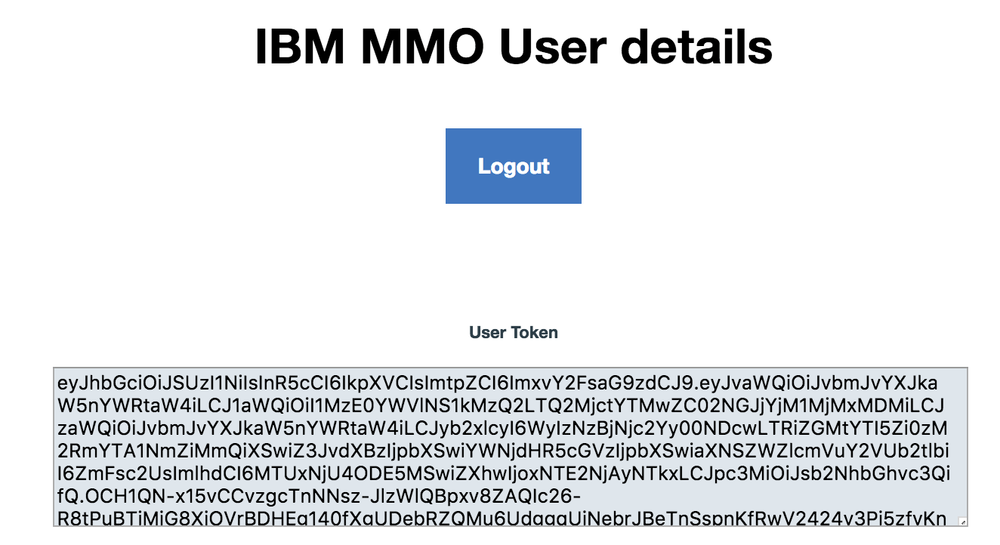
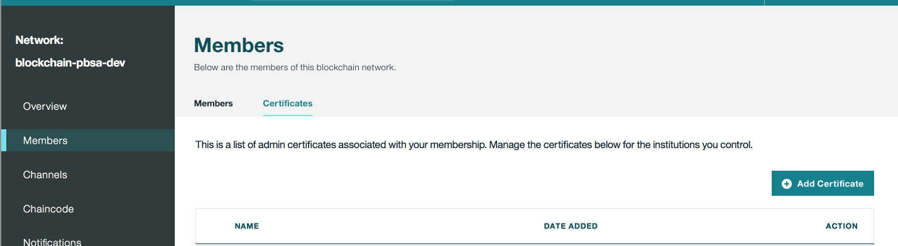

---

copyright:
  years: 2018
lastupdated: "2018-03-08"

---

{:new_window: target="_blank"}
{:shortdesc: .shortdesc}
{:screen: .screen}
{:codeblock: .codeblock}


# Provision the service (manual process)
{: #provision-the-service}
Once an organization has purchased the Blockchain Document Store service,
and subscribed to an instance of IBM Blockchain on IBM Cloud, an authorized
Network Administrator for the organization must provision the service to the network.
{:shortdesc}

To provision the Blockchain Document Store service, a Network Administrator for
the organization uploads the organization's Membership Administrator Public
(MAP) Certificate to the network. Then they contact their IBM Blockchain service
provider to have the service installed on the network and instantiated on their
network channels.

Note: Channels are subgroups of IBM Blockchain peers, which enable private and
confidential transactions (including communications) between channel members
(peer owners).

Provisioning the Blockchain Document Store service consists of three tasks, which
must be done in sequential order:

A. Upload Membership Administrator Public (MAP) Certificate to the network
(Organization Network Administrator)
B. Install Blockchain Document Store service on the organization's IBM Blockchain
network (Service Provider)
C. Instantiate Blockchain Document Store service on the organization's network
channels (Service Provider)


## A. Upload Membership Administrator Public (MAP) Certificate
An authorized Network Administrator for the member organization must upload the
organization's **Member Administrator Public (MAP) Certificate** to the IBM
Blockchain network. The MAP Certificate authorizes the Blockchain Document
Store service to upload chaincode to the network, which enables the organization
to use the service.

The Network Administrator for the member organization must complete the following  
five steps to upload the MAP Certificate:

### Step 1: Generate a user token
The organization Network Administrator must complete the following process to
generate a user token, which authorizes them to upload the MAP Certificate:

1. As shown below in Figure 1, log in to IBM MMO with your organization Network
Administrator ID and password (your role-authorized IBMid),
at https://*service-onboarding-basepath*/v1/logins/onboardingadmin.
Note: The *service-onboarding-basepath* value is unique for each member
organization - contact your service provider.


Figure 1. IBM MMO login

2. As shown below in Figure 2, copy the generated IBM MMO user token, which is a
randomly-generated hash. You will specify this token, with a curl command, in
the next step.


Figure 2. IBM MMO user token

### Step 2: Download the Member Administrator Public (MAP) Certificate
The organization Network Administrator must then download the MAP Certificate
from the network, as follows:

(**Note**: Choose the curl command below in either 1. or 3.)

1. Run the following curl command:

(TBA onboarding URL)

```
curl -X GET "https://<bds-onboarding-basepath>/v1/networks/certificates/admin_public_certificates" -H "accept: application/json" -H "Authorization: bearer <user_token from step 1>" |  jq -r '.response' | base64 --decode
```

The curl command generates a Membership Administrator Public (MAP) Certificate.

2. A MAP Certificate (randomly-generated hash) is returned, similar to the following
example:


```
-----BEGIN CERTIFICATE-----
MIICKDCCAc+gAwIBAgIUdoSPA11F46Yf8EgvPNG5xLjCSbYwCgYIKoZIzj0EAwIw
EG9yZzEuZXhhbXBsZS5jb20wHhcNMTgwMTIyMDMwMDAwWhcNMTkwMTIyMDMwMDAw
………
BAMCA0cAMEQCIEqNjxk5GEITjGKxmNbn6GPHfxRO0TyaMNf3qU1y7X09AiBdCnp3
boKyTuBKTpItN0sykslpRiBIBm1Icc+uWjM4tg==
-----END CERTIFICATE-----
```

Copy the generated certificate for use in the next step.

3. As an alternative to the previous curl command in 1., run the following curl
command and decode the response:

(TBA BDS onboarding URL)

```
curl -X GET "https:// <bds-onboarding-basepath>/v1/networks/certificates/admin_public_certificates" -H "accept: application/json" -H "Authorization: bearer <user_token from step 1>"
```

Then decode the response object value, at [BASE64 ](https://www.base64decode.org/){:new_window}.

Copy the generated certificate for use in the next step.

### Step 3: Upload the MAP Certificate
An authorized Network Administrator for the member organization must then upload
their organization's Member Administrator Public (MAP) Certificate to the network,
as follows:

As shown below in Figure 3, log in to the IBM Blockchain Members interface and
click **Add Certificate** from the **Members** tab:


Figure 3. IBM Blockchain Members interface

As shown below in Figure 4, enter a **Name** for the MAP Certificate (PEM-encoded)
and paste the generated **Certificate** from the previous step. Then click **Submit**
to upload the MAP Certificate to the network.

")
Figure 4. IBM Blockchain Members interface – Add Certificate (PEM)


### Step 4: Restart the peers
To activate the uploaded Member Administrator Public (MAP) Certificate on each
member peer, each peer must be restarted:

As shown below in Figure 5, select the **Overview** tab, and then stop and restart
each peer:

")
Figure 5. IBM Blockchain Members interface – Restart peers


### Step 5: Sync certificates
After restarting the organization peers, the MAP Certificate must be synced
across all organization peers:

As shown below in Figure 6, select the **Channels** tab, and from the **Actions** menu
select **Sync Certificates** for each channel:

")
Figure 6. IBM Blockchain Members interface – Sync certificates


## B. Install the service
To have the instance of the IBM Blockchain Document Store service installed on the
network, the organization Network Administrator must contact the IBM Blockchain
network service provider.


## C. Instantiate the service
To have the instance of the Blockchain Document Store service instantiated on
the appropriate network channels, the organization Network Administrator must
contact the IBM Blockchain network service provider.
