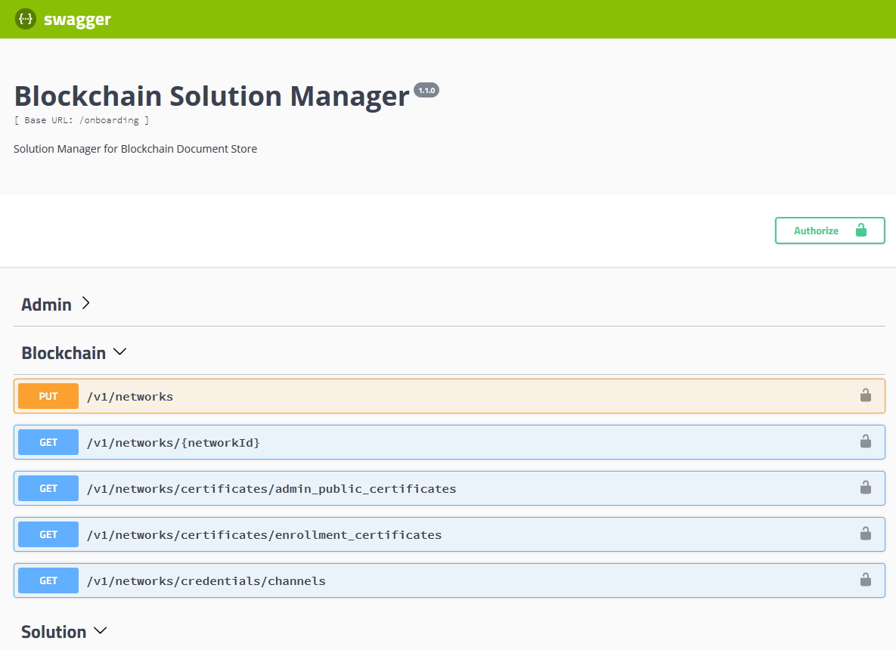

---

copyright:
  years: 2018
lastupdated: "2018-04-27"

---

{:new_window: target="_blank"}
{:shortdesc: .shortdesc}
{:screen: .screen}
{:codeblock: .codeblock}
{:pre: .pre}

# Blockchain Solution Manager API
The **Blockchain Solution Manager** API enables authenticated, authorized users
(humans, systems and applications) to manage blockchain networks, solutions, organizations, roles
and users. All tasks are done by making a [Blockchain Solution Manager API (Swagger) ](https://dev.pbsa-dev1.us-south.containers.mybluemix.net/onboarding/swagger/#/){:new_window} call.

Descriptions of the Blockchain Solution Manager [API endpoints](#api-endpoints) are provided below. To manually
call an endopoint, use the [Swagger interface ](https://stage.pbsa-dev1.us-south.containers.mybluemix.net/docstore/swagger-ui.html){:new_window}.

**Attention**: The defined roles that are authorized to call each endpoint are also listed in
[Blockchain Solution Manager API ACLs](solution-manager-acls.html).

## Swagger API interface
In the [Blockchain Solution Manager API ](https://dev.pbsa-dev1.us-south.containers.mybluemix.net/onboarding/swagger/#/){:new_window},
click any endpoint to view the description, parameters and responses. Click **Try it out!** to
enter test values, and click **Execute** to view the test responses (Figure 1.):

  Figure 1. Blockchain Solution Manager API

## Authorization
To get authorized (OAuth 2.0) to call Blockchain Solution Manager API endpoints,
click the green **Authorize** lock icon in the upper right of the [Blockchain Solution
Manager API (Swagger) ](https://dev.pbsa-dev1.us-south.containers.mybluemix.net/onboarding/swagger/#/){:new_window}.
Enter your **Onboarding Token (Bearer)**; authorization to call specific endpoints will be granted
based on your assigned roles. An **XUserToken** is also required only when calling the **Blockchain /v1/networks/certificates/enrollment_certificates** endpoint. Click **Authorize** to submit your token.

## API endpoints
The following API endpoints are available for managing your blockchain networks, solutions,
organizations, roles and users, at [Blockchain Solution Manager API ](https://dev.pbsa-dev1.us-south.containers.mybluemix.net/onboarding/swagger/#/){:new_window}.

**Note**: All **Models** are documented in the [Blockchain Solution Manager API ](https://dev.pbsa-dev1.us-south.containers.mybluemix.net/onboarding/swagger/#/){:new_window}.

### Admin
<dl>
<dt> GET /v1/administrators</dt>
<dd>Retrieves the registered Network Administrators for an instance of Blockchain Solution Manager. The caller must be a Network Administrator.</dd>
<dt> POST /v1/administrators</dt>
<dd>Adds (registers) Network Administrators to an instance of IBM Blockchain Solution Manager. The caller must be a Network Administrator.</dd>
<dt> DELETE /v1/administrators</dt>
<dd>Deletes Network Administrators from an instance of IBM Blockchain Solution Manager. The caller must be a Network Administrator.</dd>
<dt> PUT /v1/idp</dt>
<dd>Stores or updates an identity provider configuration for the network. An identity provider configuration is defined according to the relying party configuration, or dynamic profiles of the OpenID Connect protocol. The caller must be a Network Administrator.</dd>
<dt> GET /v1/idp</dt>
<dd>Retrieves the identity provider configurations for the network. The caller must be a Network Administrator.</dd>
<dt> GET /v1/idp/{name}</dt>
<dd>Retrieves the specified identity provider configuration file {name}. The caller must be a Network Administrator.</dd>
<dt> DELETE /v1/idp/{name}</dt>
<dd>Deletes the specified identity provider configuration file {name}. The caller must be a Network Administrator.</dd>
</dl>

### Blockchain
<dl>
<dt> PUT /v1/networks</dt>
<dd>Adds a member organization to the blockchain network, based on the specified network connection profile (service credential JSON from an IBM Blockchain account). The member, channels, and nodes (peers) specified in the Blockchain Network Connection Profile are created. The caller must be a Network Administrator or Service Broker.</dd>
<dt> GET /v1/networks/{networkID}</dt>
<dd>Retrieves the Blockchain Network Configuration Profiles (blockchain networks). The caller must be a Network Administrator.
</dd>
<dt> GET /v1/networks/certificates/admin_public_certificates</dt>
<dd>Retrieves the **Chaincode Administrator Certificate** for the network. The caller must be a Network Administrator or Solution Administrator. 
**Parameters**:  
  *networkId* - Blockchain Network ID (The *x-networkId* values in your IBM Blockchain Platform connection profile)" 
  *memberId* - MSP ID of the member organization.</dd>
<dt> GET /v1/networks/certificates/enrollment_certificates</dt>
<dd>Retrieves the network **Enrollment Certificate** for the specified user. The caller must be a Solution Administrator. 
**Parameters**:  
  *roleId* - Unique identifier (UUID) of the **Role**. This parameter **is required if** the attribution to transaction of the organization is based on roles for the user's organization.  
  *oid* - Required. Organization ID for the user.  
  *sid* - Required. Solution ID for the user.  
  *uid* - Required. Unique identifier (UUID) for the user.</dd>
<dt> GET /v1/networks/credentials/channels</dt>
<dd>Retrieves the connection profile for the specified channel.  
**Parameters:**  
  *channelId* - Required. The ID of the channel. 
  *networkId* - Required. The ID of the network./dd>
</dl>

### Solution
<dl>
<dt> PUT /v1/solutions</dt>
<dd>Creates or updates an instance of an IBM Blockchain Solution. The caller must be a Network Administrator. To specify accounts (users), the networkId and memberId must have already been registered by a call to the **/v1/networks/{network_id}** endpoint. **If no accounts (users) are specified**, this API creates the network. 
**Parameters**: 
  *solutionId* - Required if a solution is being updated. ID of the Solution to be updated. 
  *onboardingdata* - A JSON object specifying the solution parameters to create or update.</dd>
<dt> GET /v1/solutions</dt>
<dd>If a *solutionId* is **not** specified, retrieves the solution IDs. If a solutionId is specified, exports the solution. The authenticated user must be a Network Administrator. 
**Parameters**: 
  *solutionId* - Required to export a solution. ID of a solution to be exported.
</dd>
</dl>

### Organizations
<dl>
<dt> PUT /v1/organizations</dt>
<dd>Creates or updates a member organization. The caller must be a Network Administrator or Solution Administrator. 
**Parameters**: 
  *organization* - The name of the organization to create. 
  *solutionId* - UUID of a solution associated with the organization.</dd>
<dt> GET /v1/organizations/{organizationId}</dt>
<dd>Retrieves organization information. The caller must be a
Network Administrator, Solution Administrator or Organization Administrator. 
Parameters: 
  *solutionId* - UUID of a solution associated with the organization. 
  *organizationId* - Required. UUID of the organization.
</dd>
<dt> GET /v1/organizations/{organizationId}/administrators</dt></dt>
<dd>Retrieves the administrators for the organization. The caller must be a Network Administrator, Solution Administrator or Organization Administrator. 
**Parameters**: 
  *solutionId* - UUID of a solution associated with the organization. 
  *organizationId* - Required. UUID of the organization.
</dd>
<dt> POST /v1/organizations/{organizationId}/administrators</dt></dt>
<dd>Adds one or more administrators to an organization. The caller must be a Network Administrator, Solution Administrator or
Organization Administrator. 
Parameters: 
  *solutionId* - UUID of a solution associated with the organization. 
  *organizationId* - Required. UUID of the organization. 
  *administrators* - Required. Administrator accounts (email addresses) to add.
</dd>
<dt> DELETE /v1/organizations/{organizationId}/administrators</dt></dt>
<dd>Deletes administrators from the organization. The caller must be a Network Administrator, Solution Administrator or Organization Administrator. 
**Parameters:** 
  *solutionId* - UUID of a solution associated with the organization. 
  *organizationId* - Required. UUID of the organization. 
  *administrators* - Administrator accounts to delete.
</dd>
</dl>

### Roles
<dl>
<dt> PUT /v1/roles</dt>
<dd>Creates or replaces the defined roles for the solution. The caller must be a Network Administrator or Solution Administrator. 
**Parameters**: 
  *solutionId* - UUID of the solution. If not specified, roles are added to the default *solutionId*. 
  *roles* - Required. A list (array) of role definitions.</dd>
<dt> GET /v1/roles</dt>
<dd>Retrieves the defined roles for the solution. A Network Administrator can retrieve the roles for any solution. Any user can retrieve the roles for their solution. 
**Parameters**: 
  *solutionId* - UUID of the solution. If not specified, roles are retrieved from the default *solutionId*. 
</dd>
<dt> PUT /v1/roles/{roleId}</dt>
<dd>Creates or replaces a defined role for the solution. The caller must be a Network Administrator or Solution Administrator. 
**Parameters**: 
  *solutionId* - UUID of the solution. If not specified, the role is added to the default *solutionId*. 
  **roleId* - Required. The role object (name) to create.</dd>
<dt> DELETE /v1/roles/{roleId}</dt>
<dd>Deletes a defined role from the solution. The caller must be a Network Administrator or Solution Administrator. 
**Parameters**: 
  *solutionId* - UUID of the solution. If not specified, the role is deleted from the default *solutionId*. 
  *roleId* - Required. The UUID of the role to delete.</dd>
<dt> GET /v1/roles/{roleId}</dt>
<dd>Retrieves the defined roles for the specified Role ID. A Network Administrator can retrieve the role ID information for any solution. Any user can retrieve role ID information for their solution. 
**Parameters**: 
  *solutionId* - UUID of the solution. If not specified, the role is retrieved from the default *solutionId*. 
  *roleId* - Required. UUID of the role to retrieve.</dd>
</dl>

### Organization Types
<dl>
<dt> PUT /v1/organization_types</dt>
<dd>Creates or replaces organization types for the solution. The caller must be a Network Administrator or Solution Administrator. 
**Parameters**: 
*solutionId* - UUID of the solution. If not specified, the organization types are retrieved from the default *solutionId*. 
*orgtypes* - Required. A list (array) of organization types.</dd>
<dt> GET /v1/organization_types</dt>
<dd>Retrieves the defined organization types for the solution. The caller must be an authenticated Network Administrator. 
**Parameters**: 
  *solutionId* - UUID of the solution. If not specified, the organization types are retrieved from the default *solutionId*.</dd>
<dt> DELETE /v1/organization_types/{organizationTypeId}</dt>
<dd>Deletes an organization type from the solution. The caller must be an authenticated Network Administrator. 
**Parameters**: 
  *solutionId* - ID of the solution. If not specified, the organization type is deleted from the default *solutionId*.  
  *organizationTypeId* - Required. The organization type to delete.</dd>
<dt> GET /v1/organization_types/{organizationTypeId}</dt>
<dd>Retrieves an organization type for the solution. The caller must be an authenticated Network Administrator or Organization Administrator. 
**Parameters**: 
*solutionId* - ID of the solution. If not specified, the organization type is retrieved from the default *solutionId*. 
*organizationTypeId* - Required. The organization type to retrieve.</dd>
</dl>

### Search
<dl>
<dt> GET /v1/search/systems</dt>
<dd>Retrieves organization information for the solution and system users. The caller must be a Network Administrator, Solution Administrator or Organization Administrator. 
**Parameters**: 
  *solutionId* - UUID of the solution for the serviceId. 
  *serviceId* - Service ID of a system user.</dd>
<dt> GET /v1/search/users</dt>
<dd>Retrieves user information for a User ID or User Doc ID (UUID). An authenticated Network Administrator must specify a solution ID; all other authenticated callers can only search within their solution ID.  Any user registered with the solution can call this endpoint. 
**Parameters**: 
  *solutionId* - Required for an authenticated Network Administrator, otherwise ignored. UUID of the solution for the userId.  
  *userId* - User ID. 
  *userDocId* - User UUID.</dd>
<dt> GET /v1/search/organizations</dt>
<dd>Retrieves organization information.  Any user registered with the solution can call this endpoint. 
**Parameters**: 
  *solutionId* - Required for an authenticated Network Administrator, otherwise ignored. UUID of the solution.  
  *organizationName* - Name of the organization; supports partial matching and case-insensitive search within a solution.
</dd>
</dl>

### Users
<dl>
<dt> PUT /v1/organizations/{organizationId}/users</dt>
<dd>Creates a new human user UUID (userDocId) for the specified organization. 
**Parameters**: 
  *user* - User ID to create. 
  *solutionId* - UUID of the solution.
  *organizationId* - Required. UUID of the organization.
</dd>
<dt> DELETE /v1/organizations/{organizationId}/users/{userDocId}</dt>
<dd>Deletes the specified human user (userDocId). 
**Parameters**: 
  *solutionId* - UUID of the solution. 
  *organizationId* - Required. UUID of the organization. 
  *userDocId* - Required. UUID of the user.
</dd>
<dt> POST /v1/organizations/{organizationId}/users/{userDocId}/roles/{roleId}</dt>
<dd>Adds a role to the specified human user (userDodId). 
**Parameters**: 
  *solutionId* - UUID of the solution. 
  *organizationId* - Required. UUID of the organization. 
  *userDocId* - Required. UUID of the user. 
  *roleId* - Required. UUID of the role.
</dd>
<dt> DELETE /v1/organizations/{organizationId}/users/{userDocId}/roles/{roleId}</dt>
<dd>Deletes a role from a user. 
**Parameters**: 
  *solutionId* - UUID of the solution. 
  *organizationId* - Required. UUID of the organization. 
  *userDocId* - Required. UUID of the user. 
  *roleId* - Required. UUID of the role.
</dd>
</dl>

### Systems
<dl>
<dt> PUT /v1/organizations/{organizationId}/systems</dt>
<dd>Creates a new System User Service ID. 
**Parameters**: 
  *user* - System user definition. 
  *solutionId* - UUID of the solution. 
  *organizationId* - Required. UUID of the organization.
</dd>
<dt> DELETE /v1/organizations/{organizationId}/systems/{systemDocId}</dt>
<dd>Deletes the specified system user. 
**Parameters**: 
  *solutionId* - UUID of the solution. 
  *organizationId* - Required. UUID of the organization. 
  *systemDocId* - Required. UUID of the system user. 
</dd>
<dt> POST /v1/organizations/{organizationId}/systems/{systemDocId}/roles/{roleId}</dt>
<dd>Adds a role to the specified system user. 
**Parameters**: 
  *solutionId* - UUID of the solution. 
  *organizationId* - Required. UUID of the organization. 
  *systemDocId* - Required. UUID of the system user. 
  *roleId* - Required. UUID of the role.
</dd>
<dt> DELETE /v1/organizations/{organizationId}/systems/{systemDocId}/roles/{roleId}</dt>
<dd>Deletes a role from the specified system user. 
**Parameters**: 
  *solutionId* - UUID of the solution. 
  *organizationId* - Required. UUID of the organization. 
  *systemDocId* - Required. UUID of the system user. 
  *roleId* - Required. UUID of the role.
</dd>
</dl>

### OAuth
<dl>
<dt> GET /v1/jwks</dt>
<dd>Retrieves an IAM IBMid idaas.iam.ibm.com public key (OAuth 2.0 JWKS). Any IBM
Cloud user can call this endpoint. 
**Parameters**: 
  No parameters.</dd>
<dt> POST /v1/jwks</dt>
<dd>Submits an IAM IBMid idaas.iam.ibm.com public key (OAuth 2.0 JWKS). Any IBM
Cloud user can call this endpoint. 
**Parameters**: 
  No parameters.</dd>
<dt> GET /v1/onboarding_jwks</dt>
<dd>Retrieves public keys for the generated **Onboarding Tokens**. Any IBM
Cloud user can call this endpoint. 
**Parameters**: 
  No parameters.</dd>
<dt> POST /v1/auth/reference_token</dt>
<dd>System Users only. Requests a **Reference Token** on behalf of another System User, in exchange for the submitted **Onboarding Token**.  
**Parameters**: 
  *onboarding_token* - Required. The **Onboarding Token** to exchange.</dd>
<dt> GET /v1/auth/introspect</dt>
<dd>System Users only. Returns information about the submitted **Onboarding Token** in a consumable format. 
**Parameters**: 
  No parameters.</dd>
<dt> GET /v1/logins</dt>
<dd>Redirects the caller to the user interface login (OAuth 2.0) for a solution. 
**Parameters**: 
  *username* - Required. User name. 
  *password* - Required. Password for the user name. 
  *grant_type* - Required. Select a grant type. 
  *client_id* - Required. Specify the solutionId value. 
  *organization_id* - Specify an organization_id if the serviceId is not unique across the solution.</dd>
<dt> POST /v1/iam/exchange_token/solution/{solutionId}/organization/{organizationId}</dt>
<dd>Exchanges an IBM Cloud IAM Token (issued by https://iam.ng.bluemix.net/oidc/token) for an **Onboarding Token**. 
**Parameters**: 
  *solutionId* - Required. UUID of the solution. 
  *organizationId* - Required. UUID of the organization. 
  *apiusertoken* - Required. IBM Cloud IAM Token returned by the https://iam.ng.bluemix.net/oidc/token endpoint.
</dd>
<dt> POST /v1/iam/exchange_token/apps/{appId}</dt>
<dd>Application System Users only. Exchanges an IBM Cloud IAM Token (issued by https://iam.ng.bluemix.net/oidc/token) for an **Onboarding Token**. 
**Parameters**: 
  *appId* - Required. Application ID associated with the Service ID. 
  *apiusertoken* - Required. IBM Cloud IAM Token returned by the https://iam.ng.bluemix.net/oidc/token endpoint.
</dd>
<dt> GET /v1/logout</dt>
<dd>Logs user out of OAuth 2.0 session. 
  *returnTo* - Optional URL to return user to following logout.
  </dd>
</dl>

### Applications
<dl>
<dt> PUT /v1/apps</dt>
<dd>Adds an application (as a system user). The caller must be an authenticated
Network Administrator or Service Broker. 
**Parameters**: 
  *application* - The application definition.
</dd>
<dt> GET /v1/apps</dt>
<dd>Retrieves applications (as system users). The caller must be an authenticated
Network Administrator or Service Broker. 
**Parameters**: 
  No parameters.</dd>
dt> PUT /v1/apps/{appId}/policy</dt>
<dd>Creates or updates the policy for the specified application. The caller must be an authenticated
Network Administrator or Service Broker. 
**Parameters**: 
  *appId* - The application ID. 
  *policy* - The IDs of the applications, organizations, users (userDocId), and roles that are subject to
  the application policy.
  </dd>
<dt> GET /v1/apps/{appId}/policy</dt>
<dd>Retrieves the policy for the specified application. The caller must be an authenticated
Network Administrator or Service Broker, or an application System User for the specified {appId}. 
**Parameters**: 
*appId* - Required. The application ID.
</dd>
<dt> DELETE /v1/apps/{appId}</dt>
<dd>Deletes the specified application. The caller must be an authenticated
Network Administrator or Service Broker. 
**Parameters**: 
  *appId* - Required. The application ID.
</dd>
<dt> GET /v1/apps/{appId}</dt>
<dd>Retrieves the specified application. The caller must be an authenticated
Network Administrator, Service Broker, or application System User for the specified {appId}. 
**Parameters**: 
  *appId* - Required. The application ID.
</dd>
<dt> GET /v1/apps/{appId}/chaincodes</dt>
<dd>Retrieves the chaincode for the specified application. The caller must be an authenticated
Network Administrator or Organization Administrator. 
**Parameters**: 
*appId* - Required. The application ID.
</dd>
<dt> PUT /v1/apps/{appId}/chaincodes</dt>
<dd>Updates the chaincode for the specified application. The caller must be an authenticated
Network Administrator or Organization Administrator. 
**Parameters**: 
*appId* - Required. The application ID. 
*chaincode* - Required. The application chaincode.
</dd>
</dl>

### Developer
<dl>
<dt> GET /api-docs.json</dt>
<dd>Exports the IBM Blockchain  APIs as JSON. 
**Parameters**: 
No parameters.
</dd>
</dl>
