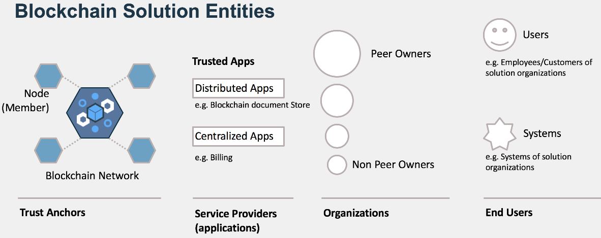

---

copyright:
  years: 2018
lastupdated: "2018-12-12"

---

{:new_window: target="_blank"}
{:shortdesc: .shortdesc}
{:screen: .screen}
{:codeblock: .codeblock}
{:pre: .pre}

# About solutions

A blockchain **solution** is a collection of data management services provided to member organizations on a private blockchain network. **IBM Blockchain solutions**, such as **IBM Food Trust**, include three classes of participants:

- **Trust Anchors**: Member Organizations that guarantee the enforcement of the network trust model and maintain the blockchain network.
- **Member Organizations**: Authorized business enterprises and related entities that record,  process, and share data through a blockchain solution on a private network.
- **Service Providers**: Centralized or decentralized software as a service (SaaS), aka **Trusted Apps**, that process data for solution member organizations.

## Solution metadata

The blockchain network, solution, and member organizations are defined in the solution metadata, by **Network Administrators**, **Solution Administrators**, and **Organization Administrators**, using the following parameters:

- **Organization Types** - Set of values representing specific types of member organizations, such as Manufacturer, Shipper, Freight Forwarder, and Retailer.  
- **Solution Roles** - Set of values representing the specific roles that can be assigned to individual human users, system users, and applications, such as Store Manager, Farmer, Dispatcher, Auditor, or Inspector. Any set of Solution Roles can be linked to a specific organization type.  
- **Organization Onboarding** - Set of values that uniquely identifies an member organization and its administrators, and defines the organization's blockchain transaction attribution preference&mdash;at the organization, role, or user level.  
- **Organization-level Metadata** - Set of values that uniquely identifies an organization's Identity Provider, Users, System Users, and Roles.  
- **Service Provider Onboarding** - Set of values that uniquely identifies the service provider, the types of data that it processes, and how it shares data with solution member organizations.

## Solution entities

The structure of a blockchain solution can be described by its entities, or the virtual and physical components that define the solution. As shown below in Figure 1, solution entities fall into four general categories:

Figure 1. Blockchain solution entities

The four categories of blockchain solution entities are described as follows:

- **Blockchain Network** - Managed by **Trust Anchor** Organizations - The virtual and physical components that uniquely define the blockchain network, such as transaction ordering service, transaction validation protocol, consensus algorithm, and ordering peers.
- **Trusted Applications** - Managed by **Service Providers** - Both centralized and decentralized applications are registered with the solution for processing data and submitting processed data to blockchain.  
- **Peers** - Managed by **Member Organizations** - Peer nodes share the blockchain ledger with other peer nodes on a network channel to maintain a single, trusted source of all network transactions.
- **Users** - Managed by Other **Users** - Registered and authenticated human users, system users, and applications use the blockchain solution to manage their organization and to upload, share, and process data.

## Federated solutions

The **IBM Blockchain Document Store** service enables organizations to run **federated**
instances of any IBM Blockchain solution. A federated instance is essentially a clone
of a master solution instance, which allows organizations to manage their solution
users and applications privately and confidentially on the federated instance.

Support for federated solutions facilitates what is otherwise a complex architectural
challenge for blockchain network administrators, as follows:

- A solution defined as a master instance is shared by multiple federated instances
- A single user login provides access to all federated instances
- Organizations within the federation store blockchain credentials on their own instance, rather than on the master.
- Organizations can be migrated from any wallet manager in the federated solution to any other wallet manager in the federated solution.

Figure 2 below depicts the concept of federated solutions. The organization is
running a clone (federated instance) of the master solution and managing users and
applications on their federated instance.

Figure 2. Federated solutions  

## What's next?
To federate an IBM Blockchain Solution, contact your IBM support representative.
